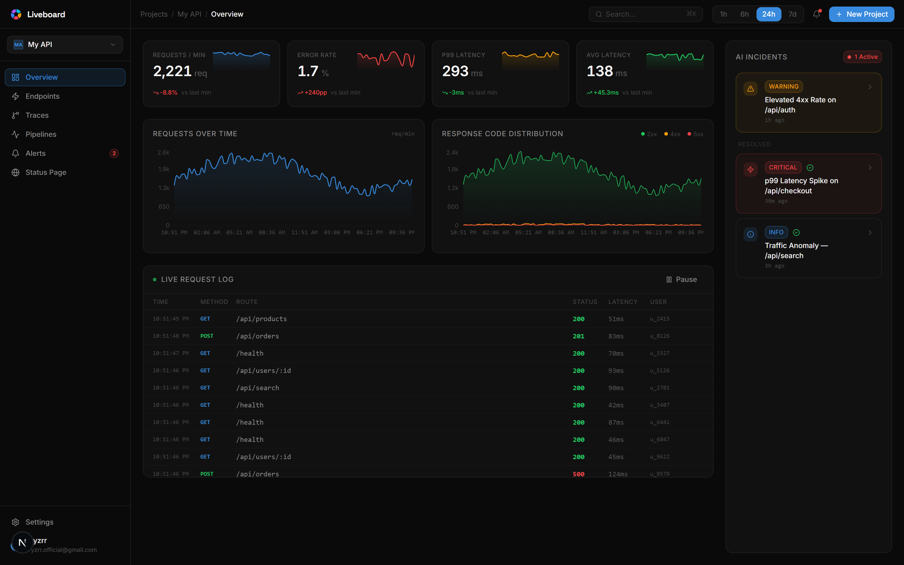
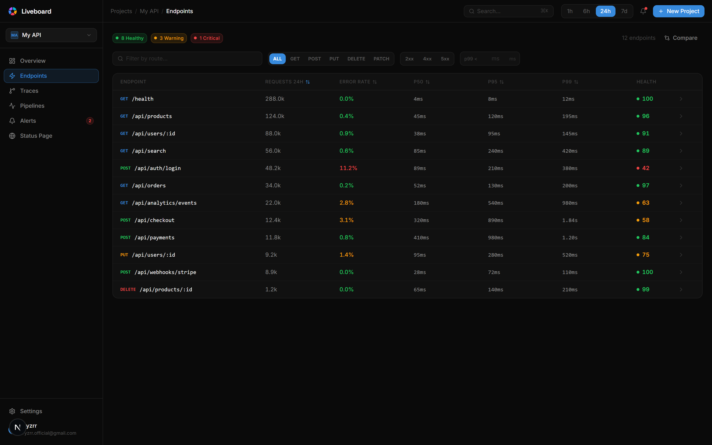
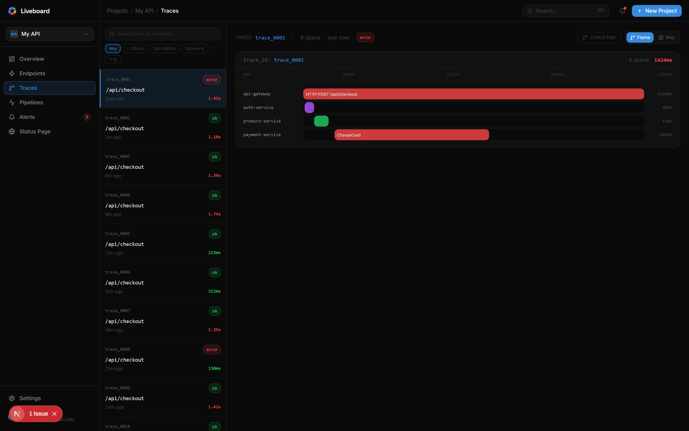
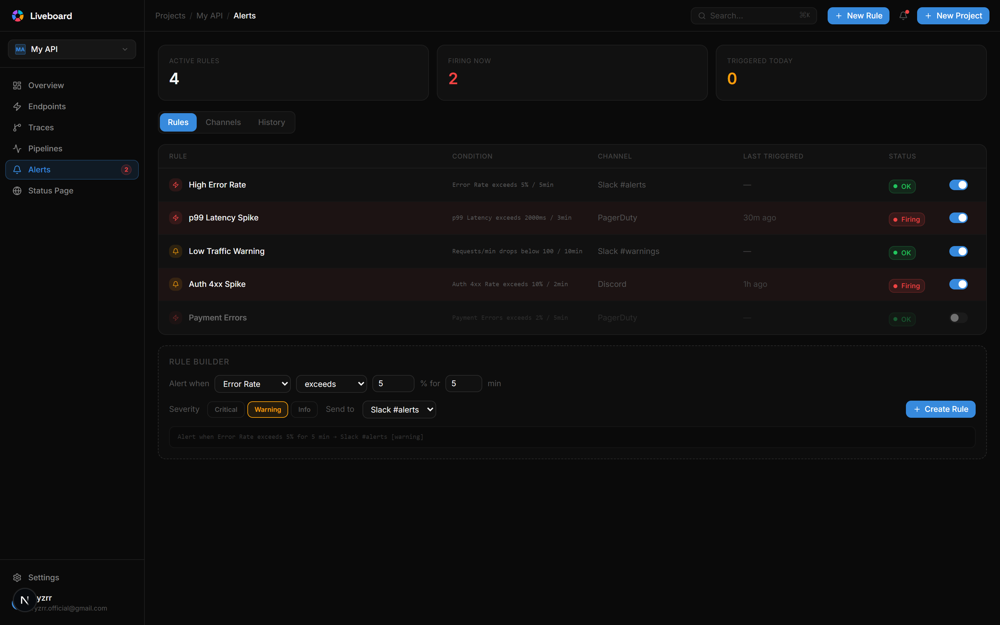
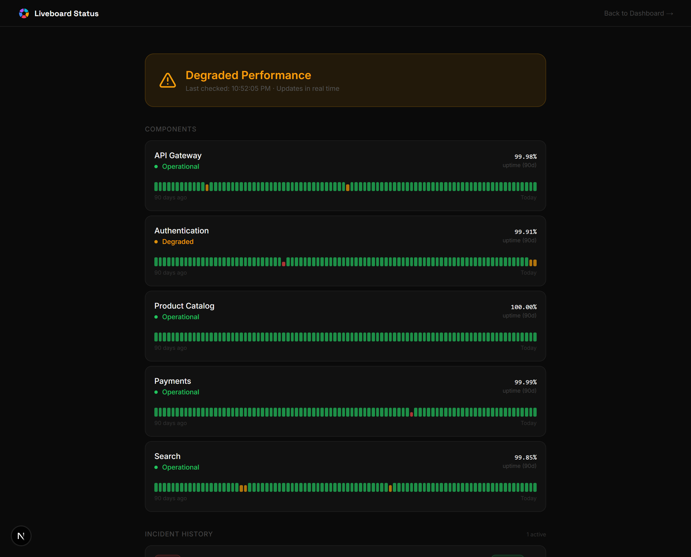
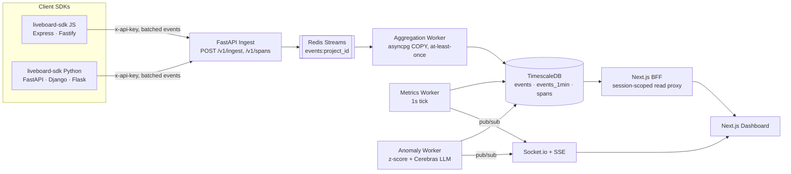

<div align="center">

<picture>
  <source media="(prefers-color-scheme: dark)" srcset="public/wordmark.svg">
  
</picture>

<br />

**Know the moment your API breaks.**

Real-time traces, live error tracking, and AI-written incident summaries — wired up with one line of middleware.

Open source. Self-hostable. No agents, no sidecars.

[](https://github.com/ryzrr/liveboard/actions/workflows/ci.yml)
[](./LICENSE)
[](https://github.com/ryzrr/liveboard/stargazers)
[](https://nextjs.org)
[](https://www.typescriptlang.org)
[](https://www.python.org)
[](https://fastapi.tiangolo.com)
[](https://www.timescale.com)
[](./infra/docker-compose.yml)
[](#contributing-anchor)

[Quick Start](#quick-start) · [Features](#features) · [Screenshots](#screenshots) · [Architecture](#architecture) · [SDKs](#sdks) · [Roadmap](#roadmap)

<br />



</div>

---

## What is Liveboard?

Liveboard is a self-hostable API observability platform — the open-source pieces you'd otherwise assemble from Datadog, Sentry, and a status page tool. Drop one line of middleware into an Express, Fastify, FastAPI, Django, or Flask app and get live request metrics, distributed traces, error tracking, AI-generated incident summaries, alert rules, and a public status page — all streaming in real time over WebSockets/SSE.

- **60-second onboarding** — `npm install liveboard-sdk` or `pip install liveboard-sdk`, one line of middleware, data on the dashboard in under 90 seconds.
- **User-centric observability** — every event is tagged with `user_id`, so you can see exactly *which* users are hitting errors, not just aggregate rates.
- **AI incident summaries** — a rolling z-score detector flags anomalies in error rate and p99 latency, then an LLM (Cerebras `llama-3.3-70b`) writes a plain-English summary of what happened.
- **OpenTelemetry-flavored tracing** — trace IDs propagate across all five SDK adapters into a flame graph and service map, no collector required.
- **Auto-generated public status page** — 90-day uptime bars, incident timelines, and email subscriptions, derived from the same live data.

<a id="features"></a>

## ✨ Features

| | |
|---|---|
| 📊 **Live dashboard** | Request volume, stacked 2xx/4xx/5xx error rate, animated stat cards with sparklines — all pushed over WebSockets as traffic happens. |
| 🔎 **Endpoint explorer** | Sortable table with p50/p95/p99, health scores, latency histograms, top errors and top affected users per route. Side-by-side endpoint comparison mode. |
| 🔥 **Distributed traces** | Flame graphs, span detail panels, critical-path highlighting, and a pure-SVG service dependency map. |
| 🚨 **Alert rules** | Metric + operator + threshold + window rule builder with a live plain-English preview, per-channel delivery, and alert history. |
| 🤖 **AI anomaly detection** | Rolling 24h z-score on error rate & p99 latency; anomalies trigger a rate-limited, deduplicated LLM incident summary. |
| 🟢 **Public status page** | Auto-generated per project — overall status badge, 90-day uptime bars, incident timelines, email subscribe/unsubscribe. |
| ⚡ **Real-time everything** | Socket.io for live metrics + incidents, SSE with `Last-Event-ID` resume for the live log tail — zero missed events on reconnect. |
| 🏢 **Multi-tenant by default** | Organizations, memberships, and per-project API keys with Postgres Row-Level Security as a DB-level tenant-isolation backstop. |
| 🔐 **Google OAuth + sessions** | NextAuth/Auth.js sign-in; the browser never sees a raw ingest key — reads go through a session-scoped BFF proxy. |
| 📦 **Two official SDKs** | JavaScript/TypeScript (Express, Fastify) and Python (FastAPI, Django, Flask), both with automatic route normalisation and trace propagation. |

<a id="screenshots"></a>

## 📸 Screenshots

<table>
<tr>
<td width="50%">

**Overview**


</td>
<td width="50%">

**Endpoint Explorer**


</td>
</tr>
<tr>
<td width="50%">

**Distributed Traces**


</td>
<td width="50%">

**Alert Rules**


</td>
</tr>
<tr>
<td colspan="2">

**Public Status Page**


</td>
</tr>
</table>

<a id="quick-start"></a>

## 🚀 Quick Start

The whole stack — Postgres/TimescaleDB, Redis, the ingest API, the aggregation worker, and the dashboard — comes up with one command.

```bash
git clone https://github.com/ryzrr/liveboard.git
cd liveboard

# Copy the env template and fill in every REQUIRED_change_me value.
# openssl rand -hex 32 is perfect for the secret fields.
cp .env.example .env

cd infra
docker compose --env-file ../.env up --build
```

| Service | URL |
|---|---|
| Dashboard | http://localhost:3000 |
| Ingest API + Swagger docs | http://localhost:8000/docs |
| Postgres (TimescaleDB) | `localhost:5432` (bound to `127.0.0.1`) |
| Redis | `localhost:6379` (bound to `127.0.0.1`) |

Sign in, and Liveboard auto-provisions your personal organization, a default project, and an API key — no manual setup step. Drop the key into one of the SDKs below and watch events land on the dashboard in real time.

> Without `GOOGLE_CLIENT_ID`/`GOOGLE_CLIENT_SECRET` set, keep `DISABLE_DEV_LOGIN=false` locally to sign in with any email for testing. **Always** set `DISABLE_DEV_LOGIN=true` outside local development — see [`.env.example`](./.env.example) for the full, documented list of variables.

<a id="sdks"></a>

## 📦 SDKs

Both SDKs batch events in the background, flush on an interval or when the buffer fills, and never throw or block your app if Liveboard is unreachable.

<table>
<tr><th width="50%">JavaScript / TypeScript</th><th width="50%">Python</th></tr>
<tr>
<td valign="top">

```bash
npm install liveboard-sdk
```

```js
import liveboard from "liveboard-sdk";

app.use(liveboard.middleware({ apiKey }));
```

Works with your existing **Express** or **Fastify** app.

</td>
<td valign="top">

```bash
pip install liveboard-sdk
```

```python
from liveboard.asgi import LiveBoardMiddleware

app.add_middleware(LiveBoardMiddleware, api_key=key)
```

Works with **FastAPI**, **Django**, or **Flask**.

</td>
</tr>
</table>

Every adapter normalises dynamic route segments (`/users/507f191e...` → `/users/:id`), propagates an `x-trace-id` header across services, and tags events with the authenticated `user_id` when it can find one — powering the endpoint explorer, trace viewer, and per-user error breakdowns out of the box.

<a id="architecture"></a>

## 🏗️ Architecture



| Layer | Tech |
|---|---|
| Client SDKs | TypeScript → npm · Python 3.9+ → PyPI |
| Ingest API | FastAPI + Uvicorn (async) |
| Message bus | Redis Streams (`XADD` / `XREADGROUP`) |
| Aggregation worker | Python asyncio + TimescaleDB `COPY` protocol |
| AI worker | Python + Cerebras SDK (`llama-3.3-70b`) |
| Database | PostgreSQL 16 + TimescaleDB (hypertables, continuous aggregates, RLS) |
| Realtime | Socket.io (WebSocket) + Server-Sent Events |
| Frontend | Next.js App Router + Tailwind + Framer Motion + Recharts |
| Auth | NextAuth/Auth.js (Google OAuth) + server-only internal service token |
| Infra | Docker Compose, GitHub Actions CI |

**Two auth planes, by design:** SDKs write with a per-project `x-api-key`; the dashboard never sees one. Browser sessions read through a same-origin BFF (`app/api/lb/[...path]`) that checks the signed-in user's org membership before forwarding to the API with a server-only internal token — backstopped by Postgres Row-Level Security scoped to `project_id`, so a compromised session can't read another tenant's rows even if the app-layer check is bypassed.

## 🔐 Environment Variables

Full reference with generation instructions lives in [`.env.example`](./.env.example) — copy it to `.env` before running Docker Compose. Highlights:

| Variable | Required | Notes |
|---|---|---|
| `POSTGRES_PASSWORD`, `REDIS_PASSWORD` | ✅ | `openssl rand -hex 32` |
| `API_SECRET_KEY` | ✅ | Ingest master key; rejected outright if weak/default when `ENVIRONMENT=production` |
| `AUTH_SECRET` | ✅ | NextAuth/Auth.js session encryption secret |
| `INTERNAL_SERVICE_TOKEN` | recommended | Separate BFF↔API token; falls back to `API_SECRET_KEY` if unset |
| `GOOGLE_CLIENT_ID` / `GOOGLE_CLIENT_SECRET` | for real sign-in | Required in production unless `DISABLE_DEV_LOGIN=false` |
| `CEREBRAS_API_KEY` | optional | Enables AI incident write-ups; anomaly detection still runs without it |
| `ALLOWED_EMAILS` / `ALLOWED_EMAIL_DOMAIN` | optional | Restrict sign-up; leave empty for open sign-up |
| `DISABLE_DEV_LOGIN` | ✅ | Kill-switch for the unverified dev-login bypass — always `true` outside local dev |

<a id="local-development"></a>

## 🧑‍💻 Local Development

Prefer running services natively instead of rebuilding containers on every change:

```bash
# Frontend (Next.js, Turbopack dev server)
npm install
npm run dev            # http://localhost:3000

# API + worker (needs Postgres/TimescaleDB + Redis reachable — spin those
# two up with `docker compose up postgres redis` from infra/ and point
# DATABASE_URL / REDIS_URL at them)
cd apps/api
pip install -r requirements.txt
uvicorn main:app --reload --port 8000

# in a second terminal
python -m worker.main
```

```bash
# Lint / typecheck, same checks CI runs
npm run lint && npx tsc --noEmit         # frontend
cd apps/api && ruff check .              # API
cd packages/sdk-js && npx tsc --noEmit && npm run build
cd packages/sdk-python && ruff check liveboard/
```

## 📁 Project Structure

```
liveboard/
├── app/                    # Next.js App Router — dashboard, auth, status page, BFF routes
│   ├── (dashboard)/        #   overview · endpoints · traces · alerts · settings
│   ├── api/                #   lb/[...path] BFF proxy, auth, projects, realtime-token
│   └── status/[slug]/      #   public status page + subscribe/unsubscribe
├── components/             # React components (charts, dashboard, traces, status, landing…)
├── hooks/                  # useMetrics, useLiveLog, useTraces, useWebSocket, …
├── lib/                    # api-client, socket, realtime helpers
├── apps/api/               # FastAPI backend
│   ├── api/routes/         #   ingest · query · alerts · spans · projects · internal · public_status
│   ├── worker/             #   aggregator · metrics · anomaly (AI) · alerts
│   ├── realtime/           #   socket_server · sse · pubsub · tokens
│   ├── streams/            #   Redis Streams producer
│   └── migrations/         #   Alembic migrations
├── packages/
│   ├── sdk-js/              # liveboard-sdk (npm) — Express, Fastify
│   └── sdk-python/          # liveboard-sdk (PyPI) — FastAPI, Django, Flask
├── infra/
│   └── docker-compose.yml   # postgres · redis · api · worker · frontend
└── .env.example              # every config variable, documented
```

<a id="roadmap"></a>

## 🗺️ Roadmap

Liveboard is shipped through self-hosted, multi-tenant SaaS foundations (organizations, per-project API keys, Postgres RLS tenant isolation). What's next:

- [ ] CLI (`liveboard-cli`) for local onboarding and key management
- [ ] Hosted Mintlify docs site — quick start, SDK reference, self-hosting guide, architecture
- [ ] Custom domains for public status pages
- [ ] Per-tenant retention policies and plan-gated quotas
- [ ] Billing (Stripe) — free/pro tiers
- [ ] Production deploy guide (Railway for API/worker, Vercel for the dashboard)
- [ ] npm / PyPI publish of `liveboard-sdk` for outside consumers

Check [open issues](https://github.com/ryzrr/liveboard/issues) or open one — good-first-issue-sized SDK adapters (Ruby, Go) and alert channels (webhook, PagerDuty) are great starting points.

<a id="contributing-anchor"></a>

## 🤝 Contributing

Contributions are welcome. Every PR runs the same CI as `main`: frontend lint + typecheck, `ruff` on the API, and a typecheck + build of `sdk-js`.

1. Fork the repo and create a branch off `main`
2. Make your change, and run the lint/typecheck commands from [Local Development](#local-development)
3. Open a PR with a clear description of what changed and why

## 📄 License

Liveboard is [MIT licensed](./LICENSE).
